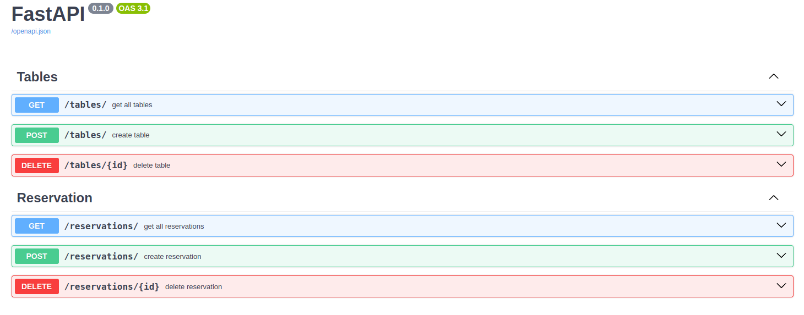

# 🍽️ Restaurant Table Reservation API

## 📌 Project Overview

This is a RESTful API service for managing table reservations in a restaurant. The API allows users to manage tables and reservations, with logic to prevent double-booking for the same time slots.

Built using **FastAPI**, **PostgreSQL**, and **SQLAlchemy**, and fully containerized using **Docker** and **docker-compose**.

---

## ✅ Features

### 📦 Models

#### Table
- `id`: int — Unique identifier
- `name`: str — Table name (e.g., "Table 1")
- `seats`: int — Number of seats
- `location`: str — Location description (e.g., "window side")

#### Reservation
- `id`: int — Unique identifier
- `customer_name`: str — Name of the customer
- `table_id`: int — Foreign key to a table
- `reservation_time`: datetime — Start time of the reservation
- `duration_minutes`: int — Duration in minutes

### 🧭 API Endpoints

#### Tables
- `GET /tables/` — Retrieve all tables
- `POST /tables/` — Create a new table
- `DELETE /tables/{id}` — Delete a table by ID

#### Reservations
- `GET /reservations/` — Retrieve all reservations
- `POST /reservations/` — Create a new reservation
- `DELETE /reservations/{id}` — Delete a reservation by ID

---

## ⚙️ Technologies Used

- Python 3.12+
- FastAPI
- PostgreSQL
- SQLAlchemy
- Alembic
- Docker & docker-compose

---

## 🚀 Getting Started

> 📌 Prerequisites: Docker and docker-compose installed.

### 1. Clone the Repository
```bash
git clone https://github.com/your-username/restaurant-reservation-api.git
cd restaurant-reservation-api
```

### 2. Build and Start the Containers
```bash
docker-compose up --build
```

### 3. Access the API Docs
Visit http://localhost:8001/docs to interact with the API via Swagger UI.

Swagger UI with endpoints overview:


---

## 🧠 Evaluation Criteria
**This project demonstrates:**

- Clean and modular project architecture

- Proper REST API design

- Correct business logic implementation (especially reservation conflicts)

- Usage of Docker and docker-compose

- Presence of migration scripts and basic test coverage

---

## 🔧 Future Improvements
- User authentication and role-based access

- Reservation update endpoint

- Admin panel or dashboard

- UI frontend (React, Next.js, or Telegram Bot)

---

## **📬 Contact**
📧 Email: [rezdomchanel@gmail.com](rezdomchanel@gmail.com)  
💬 Telegram: [@rezdom](https://t.me/rezdom)